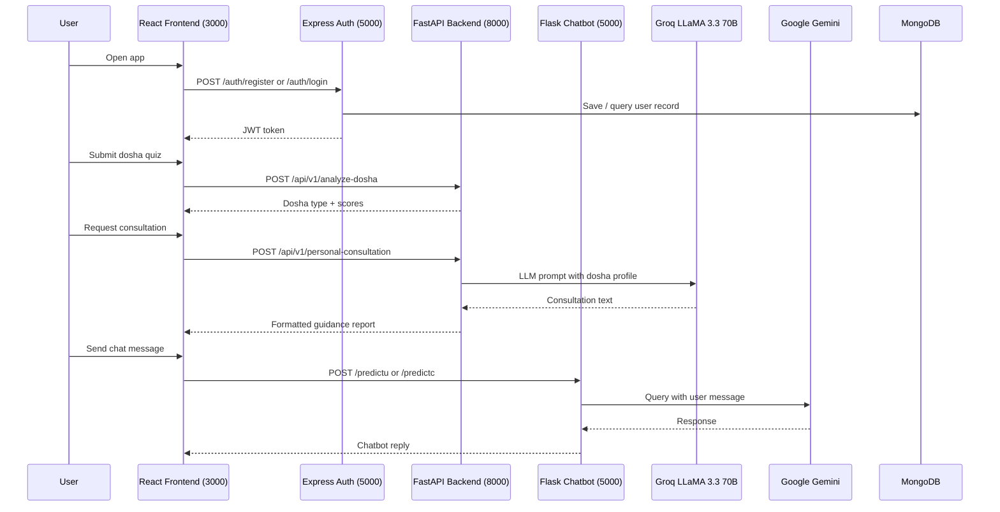

Mydva is a three-tier SaaS platform composed of four independently deployable services. The React frontend handles all user interaction and state management. Two backend services — FastAPI for Ayurvedic intelligence and Express.js for authentication — process requests independently. A separate Flask chatbot service provides conversational AI. All user data is persisted in MongoDB, and AI recommendations are generated by external providers: Groq (LLaMA 3.3 70B) for consultation logic and Google Gemini for the chatbot.

## Services

<CardGroup cols={2}>
  <Card title="FastAPI backend" icon="bolt">
    Runs on port **8000**. Handles dosha analysis, personalized consultation generation via Groq LLaMA 3.3 70B, and herbal remedy recommendations. The core AI intelligence layer of the platform.
  </Card>
  <Card title="Express.js auth backend" icon="lock">
    Runs on port **5000**. Manages user registration and login, stores credentials in MongoDB, and issues JWT tokens for session management across the platform.
  </Card>
  <Card title="React frontend" icon="browser">
    Runs on port **3000**. Built with Material UI and Redux. Handles all routing via react-router-dom, protects authenticated routes with a `ProtectedRoute` component, and communicates with both backends via REST.
  </Card>
  <Card title="Flask chatbot" icon="message">
    Runs on port **5000** (configurable). A standalone Flask service powered by Google Gemini that responds to natural-language Ayurvedic queries via the `/predictu` and `/predictc` endpoints.
  </Card>
</CardGroup>

## Data flow

The following diagram shows how a request travels from the user through the platform:

## Service summary

| Service | Technology | Port | Responsibility |
|---|---|---|---|
| Frontend | React, Redux, Material UI | 3000 | UI, routing, state management, authenticated views |
| Dosha & AI backend | FastAPI (Python) | 8000 | Dosha analysis, LLM recommendations, herbal remedies |
| Auth backend | Express.js (Node.js) | 5000 | User registration, login, JWT issuance, MongoDB writes |
| Chatbot | Flask (Python) | 5000 | Conversational Ayurvedic assistant via Google Gemini |

<Note>
  The Express.js auth backend and the Flask chatbot both default to port `5000`. When running locally, configure the Flask service to use a different port (for example, `5001`) to avoid conflicts.
</Note>

## API endpoints

| Method | Path | Service | Purpose |
|---|---|---|---|
| `POST` | `/auth/register` | Express.js | Create a new user account |
| `POST` | `/auth/login` | Express.js | Authenticate and receive a JWT |
| `POST` | `/api/v1/analyze-dosha` | FastAPI | Submit quiz responses and get dosha type |
| `GET` | `/api/v1/recommendations/{dosha_type}` | FastAPI | Fetch dietary and lifestyle recommendations for a dosha |
| `POST` | `/api/v1/personal-consultation` | FastAPI | Generate a personalised consultation via Groq LLaMA 3.3 70B |
| `POST` | `/predictu` | Flask | Send a user message to the Gemini-powered chatbot |
| `POST` | `/predictc` | Flask | Send a context-aware follow-up to the chatbot |

## Authentication and protected routes

The React frontend uses a `ProtectedRoute` component to guard any page that requires authentication. When a user logs in, the Express.js backend returns a JWT, which the frontend stores and attaches to subsequent API requests as a Bearer token.

If the token is absent or expired, `ProtectedRoute` redirects the user to the login page before the request reaches any backend service.

<Warning>
  The FastAPI backend does not independently verify JWTs in the current architecture. Ensure all sensitive FastAPI endpoints are only reachable from the React frontend through authenticated sessions managed by the Express.js service.
</Warning>

## Environment configuration

Each service reads its configuration from environment variables. See the [environment variables reference](/configuration/environment-variables) for the full list of required and optional variables across all services.

| Variable | Used by | Description |
|---|---|---|
| `GROQ_API_KEY` | FastAPI | API key for Groq LLaMA 3.3 70B inference |
| `MONGO_URI` | Express.js | MongoDB connection string for user account storage |
| `JWT_SECRET` | Express.js | Secret used to sign and verify JWT tokens |
| `PORT` | Express.js, Flask | Overrides the default listening port |
| `REACT_APP_API_BASE_URL` | React | Base URL for FastAPI requests (default: `http://localhost:8000/api/v1`) |
